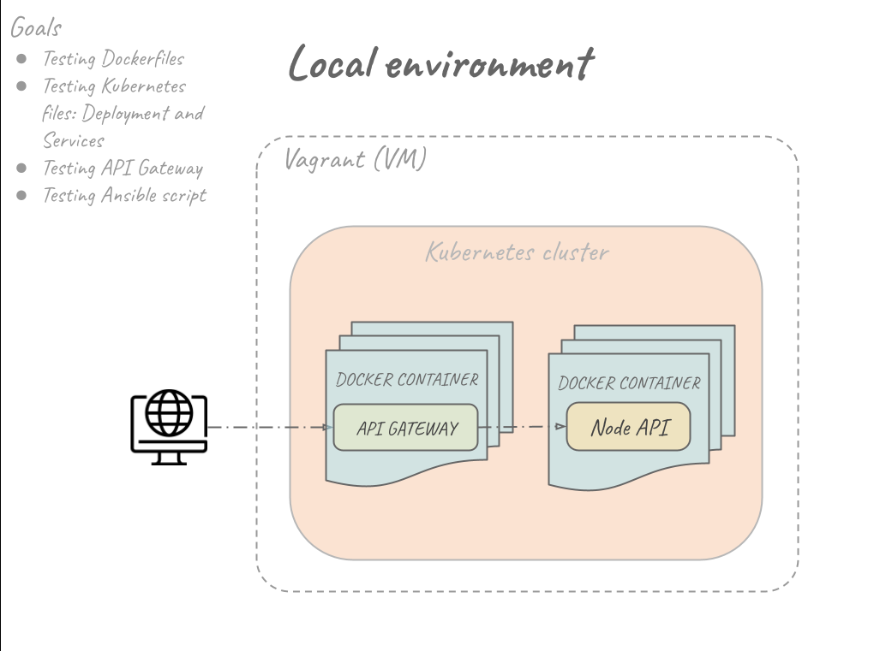
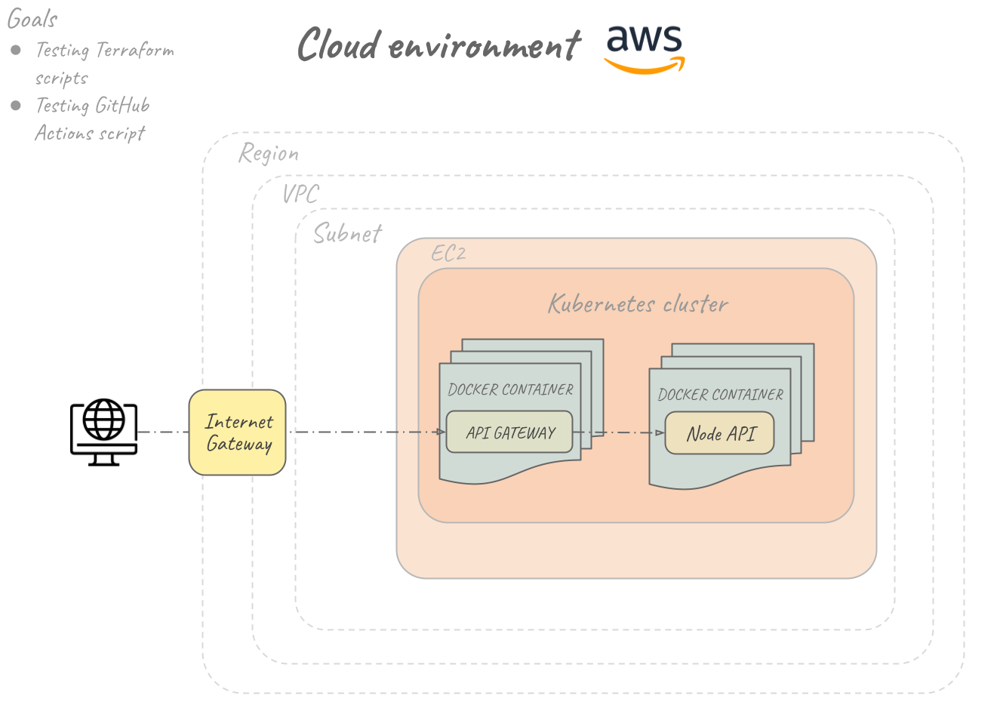

# Desafio DevOps

Este projeto tem como intuito a implantação automatizada de uma aplicação Flask: API de comentários. Com isso serão praticados os seguintes conhecimentos:

* Automação da infra, provisionamento dos hosts (IaaS)

* Automação de setup e configuração dos hosts (IaC)

* Pipeline de deploy automatizado

* Monitoramento dos serviços e métricas da aplicação

A implantação segue dois formatos: em infraestrutura local e em infraestrutura na nuvem. A infraestrutura local foi desenvolvida com o intuito de efetuar todas a etapas de testes localmente, economizando uso de serviços na clouds.

### Conteúdo
- [Infraestrutura Local](#infraestrutura-local)
- [Infraestrutura na Nuvem](#infraestrutura-na-nuvem)
- [GitHub Actions - CI/CD](#github-actions---cicd)

## Infraestrutura Local

A infraestrutura local é composta por uma máquina virtual (Virtual Machine - VM) usando o Vagrant e VirtualBox. Essa VM é configurada via Ansible, sendo instalado um cluster MicroK8s. A imagem abaixo mostra a topologia proposta, onde é instalado o Kong e a aplicação Flask de exemplo no cluster MicroK8s.

Visite a pasta [local_infra](./local_infra/) para saber mais sobre a instalação e execução.

## Infraestrutura na Nuvem

A infraestrutura na AWS é composta por uma:

* Virtual Private Cloud (**VPC**)
* Subnet
* Route Table
* Internet Gateway
* Security Group
* Elastic Compute Cloud (**EC2**)

O provisionamento é feito de forma automatizado via script Terraform.

Visite a pasta [cloud_infra](./cloud_infra/) para saber mais sobre a instalação e execução.

## GitHub Actions - CI/CD

Na pasta [.github/workflows](./.github/workflows) encontram os pipelines atualmente implementados

* [.github/workflows/cd_app.yaml](./.github/workflows/cd_app.yaml): Realiza criação da imagem Docker e publicação no DockerHub

* [.github/workflows/iac.yaml](./.github/workflows/iac.yaml): Realiza o provisionamento da infraestrutura na AWS. Para evitar gasto, a execução do script é manual
