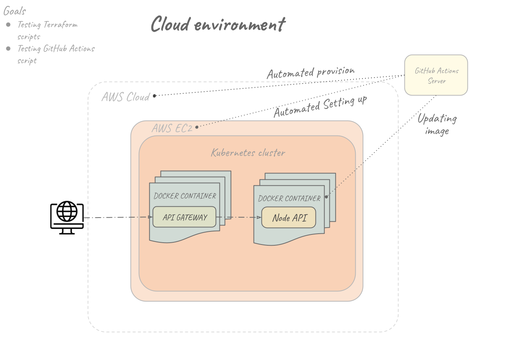

# Desafio DevOps

Este projeto tem como intuito a implantação automatizada de uma aplicação Flask: API de comentários. 
Essa implantação segue dois formatos: em infraestrutura local e em infraestrutura na nuvem.

### Infraestrutura Local

### Infraestrutura na Nuvem

## Requisitos

TODO

## Como executar?

TODO