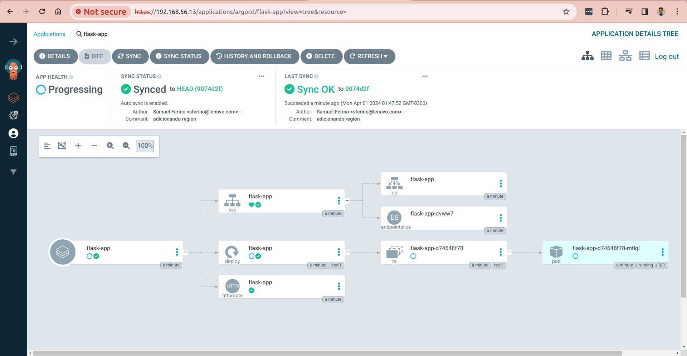

# ArgoCD scripts

Este diretório contém os scripts e comandos para execução do ArgoCD.

## Requisitos

- Cluster Kubernetes

## Como instalar?

Execute os comandos abaixo:

```bash
$ kubectl create namespace argocd
namespace/argocd created
$ kubectl apply -n argocd -f https://raw.githubusercontent.com/argoproj/argo-cd/stable/manifests/install.yaml
customresourcedefinition.apiextensions.k8s.io/applications.argoproj.io created
customresourcedefinition.apiextensions.k8s.io/applicationsets.argoproj.io created
customresourcedefinition.apiextensions.k8s.io/appprojects.argoproj.io created
serviceaccount/argocd-application-controller created
serviceaccount/argocd-applicationset-controller created
serviceaccount/argocd-dex-server created
serviceaccount/argocd-notifications-controller created
serviceaccount/argocd-redis created
serviceaccount/argocd-repo-server created
serviceaccount/argocd-server created
role.rbac.authorization.k8s.io/argocd-application-controller created
role.rbac.authorization.k8s.io/argocd-applicationset-controller created
role.rbac.authorization.k8s.io/argocd-dex-server created
role.rbac.authorization.k8s.io/argocd-notifications-controller created
role.rbac.authorization.k8s.io/argocd-server created
clusterrole.rbac.authorization.k8s.io/argocd-application-controller created
clusterrole.rbac.authorization.k8s.io/argocd-applicationset-controller created
clusterrole.rbac.authorization.k8s.io/argocd-server created
rolebinding.rbac.authorization.k8s.io/argocd-application-controller created
rolebinding.rbac.authorization.k8s.io/argocd-applicationset-controller created
rolebinding.rbac.authorization.k8s.io/argocd-dex-server created
rolebinding.rbac.authorization.k8s.io/argocd-notifications-controller created
rolebinding.rbac.authorization.k8s.io/argocd-server created
clusterrolebinding.rbac.authorization.k8s.io/argocd-application-controller created
clusterrolebinding.rbac.authorization.k8s.io/argocd-applicationset-controller created
clusterrolebinding.rbac.authorization.k8s.io/argocd-server created
configmap/argocd-cm created
configmap/argocd-cmd-params-cm created
configmap/argocd-gpg-keys-cm created
configmap/argocd-notifications-cm created
configmap/argocd-rbac-cm created
configmap/argocd-ssh-known-hosts-cm created
configmap/argocd-tls-certs-cm created
secret/argocd-notifications-secret created
secret/argocd-secret created
service/argocd-applicationset-controller created
service/argocd-dex-server created
service/argocd-metrics created
service/argocd-notifications-controller-metrics created
service/argocd-redis created
service/argocd-repo-server created
service/argocd-server created
service/argocd-server-metrics created
deployment.apps/argocd-applicationset-controller created
deployment.apps/argocd-dex-server created
deployment.apps/argocd-notifications-controller created
deployment.apps/argocd-redis created
deployment.apps/argocd-repo-server created
deployment.apps/argocd-server created
statefulset.apps/argocd-application-controller created
networkpolicy.networking.k8s.io/argocd-application-controller-network-policy created
networkpolicy.networking.k8s.io/argocd-applicationset-controller-network-policy created
networkpolicy.networking.k8s.io/argocd-dex-server-network-policy created
networkpolicy.networking.k8s.io/argocd-notifications-controller-network-policy created
networkpolicy.networking.k8s.io/argocd-redis-network-policy created
networkpolicy.networking.k8s.io/argocd-repo-server-network-policy created
networkpolicy.networking.k8s.io/argocd-server-network-policy created
$ kubectl patch svc argocd-server -n argocd -p '{"spec": {"type": "LoadBalancer"}}'
service/argocd-server patched
$ kubectl get svc -n argocd
NAME                                      TYPE           CLUSTER-IP       EXTERNAL-IP     PORT(S)                      AGE
argocd-applicationset-controller          ClusterIP      10.152.183.92    <none>          7000/TCP,8080/TCP            85s
argocd-dex-server                         ClusterIP      10.152.183.165   <none>          5556/TCP,5557/TCP,5558/TCP   85s
argocd-metrics                            ClusterIP      10.152.183.48    <none>          8082/TCP                     85s
argocd-notifications-controller-metrics   ClusterIP      10.152.183.61    <none>          9001/TCP                     85s
argocd-redis                              ClusterIP      10.152.183.238   <none>          6379/TCP                     85s
argocd-repo-server                        ClusterIP      10.152.183.32    <none>          8081/TCP,8084/TCP            84s
argocd-server-metrics                     ClusterIP      10.152.183.84    <none>          8083/TCP                     84s
argocd-server                             LoadBalancer   10.152.183.233   192.168.56.13   80:32332/TCP,443:32567/TCP   84s
$ kubectl -n argocd get secret argocd-initial-admin-secret -o jsonpath="{.data.password}" | base64 -d
DnLRQdbhyYGDUIJw
```

Tente acessar a página [http://192.168.56.13:80](http://192.168.56.13:80). Your credentials are `admin` and `DnLRQdbhyYGDUIJw`

## Como execute?

Execute o comando abaixo para configuração do argocd:

```bash
$ kubectl apply -f application.yaml
application.argoproj.io/flask-app created
```



